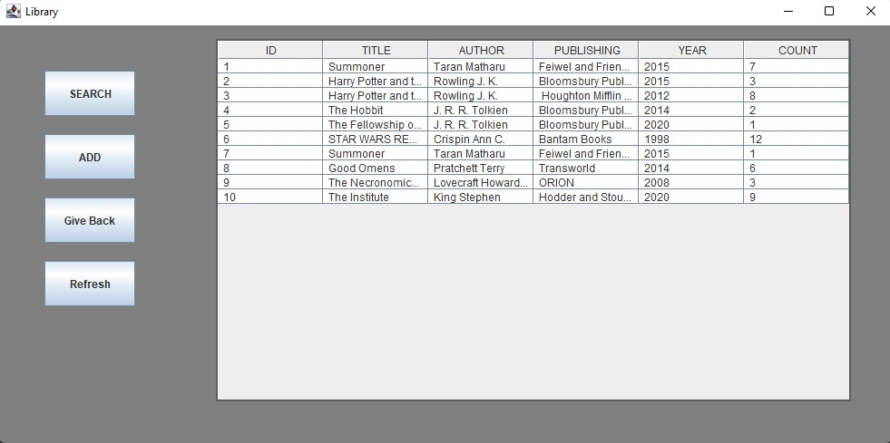
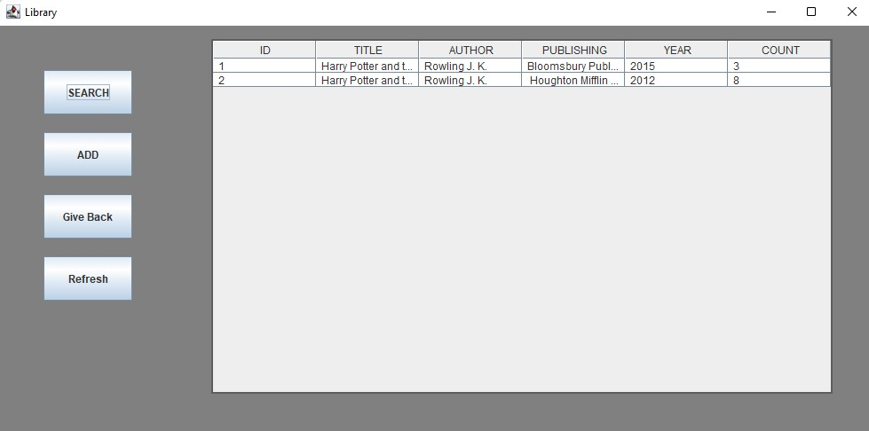
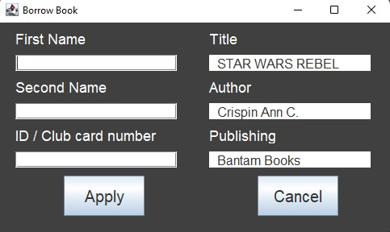
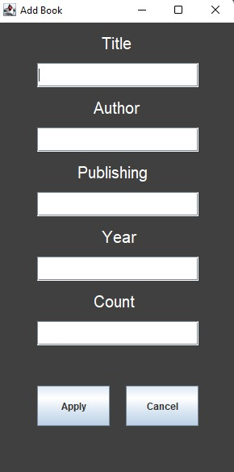

# Sample GitLab Project
<h3>This simple application is to storage books. There are four buttons and table with information about books. </h3>

  

<h3>First button is to search book when user can write any word and check if exists any books with this phrase.</h3>  

  

<h3>This application allows to borrow book, if user click on any position 
in table then will show new window with infromations, on the right side are informations about book (title author and publishing) and on the left side are fields which user data (first name, last name and ID or club card namber).</h3> 

  

<h3>Next button is  add it allows to add new books to the table. If this button is cliked then it should show windows with fields when user should add informations about book which want to add. </h3>

  

 <h3>Button "Give Back" allow to give back book which user borrow earlier.</h3> 
 

  

<h3>Last button is to refresh table with books (if user search any book and want to see every again).
Every data are saved in xml files. When new book is added, data are added in table and saved in BookBase.xml file. If user borrow book then information about this book and inforamtions abot user are saved in UserName.xml file. These files allow to load every data if application is turned on again.</h3>
